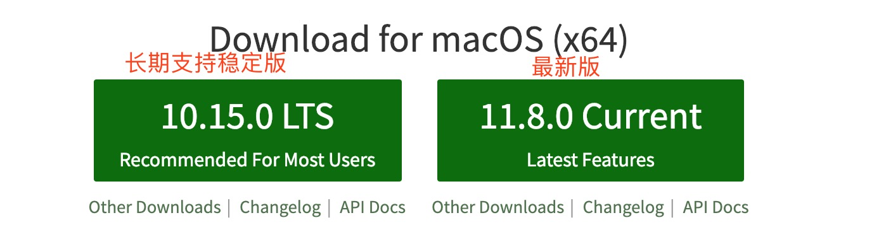
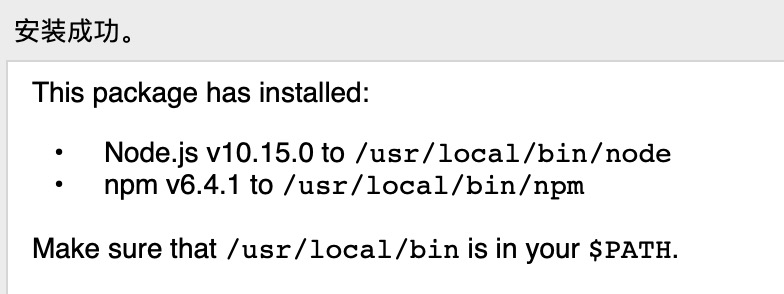

# 安装Node.js环境


直接去英文官网下载安装包



安装后环境检查

```c
$ node -v

$ node   //进入node环境,使用两次control+c或者输入.exit
```

# 包管理器npm
nodejs环境内置的包管理工具

[中国的npm服务器镜像npm.taobao.org](npm.taobao.org)
```c
$ sudo npm install cnpm -g --registry=https://registry.npm.taobao.org //使用淘宝镜像安装cnpm
```

# 第一个程序Hello World
建立 hello.js文件,文件中输出
```
console.log('hello world!');
```
控制台
```
$ node hello.js
```

# 写一个最简单的web服务器应用
server.js
```JavaScript
var http = require('http');

http.createServer(function(req,res){
    //定义HTTP头
    res.writeHead(200,{'Content-Type':'text/plan'});

    //发送相应数据
    res.end('Hello World!\n');
}).listen(8000); //8000端口

//服务运行后输出一行信息
console.log('server is running...');
```
终端执行
```
$ node server.js
```
浏览器中访问 localhost:8000