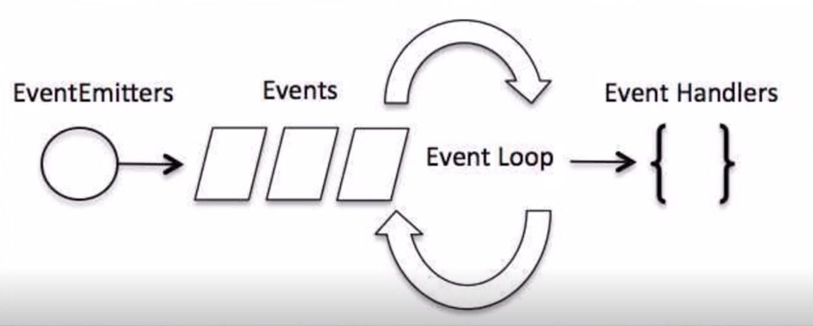

# 事件驱动模型(非阻塞式IO模型)
事件处理流程


nodejs几乎所有的事件机制都是观察者模式来实现的
# 事件处理代码流程
1. 引入events对象,创建eventEmitter对象
2. 绑定事件处理程序
3. 触发事件

# 事件与事件绑定
```
//引入events对象,创建eventEmitter对象
var events = require('events');
var eventEmitter = new events.eventEmitter
//绑定事件处理函数
var connctHandler = function connected(){
    console.log('connected被调用!');
}
//事件绑定,第一个参数事件名称,第二个事件句柄
eventEmitter.on('connection',connctHandler);
//触发事件
eventEmitter.emit('connection');

console.log('程序执行完毕');
```