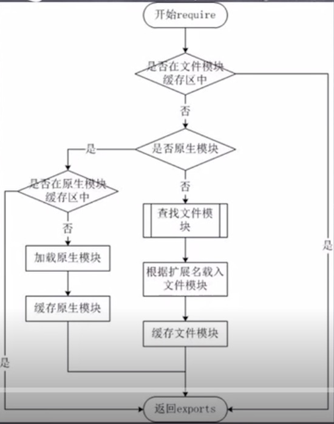
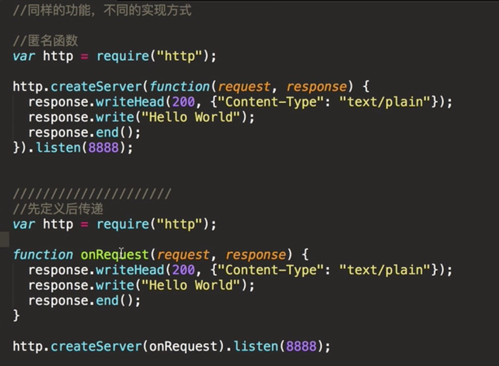
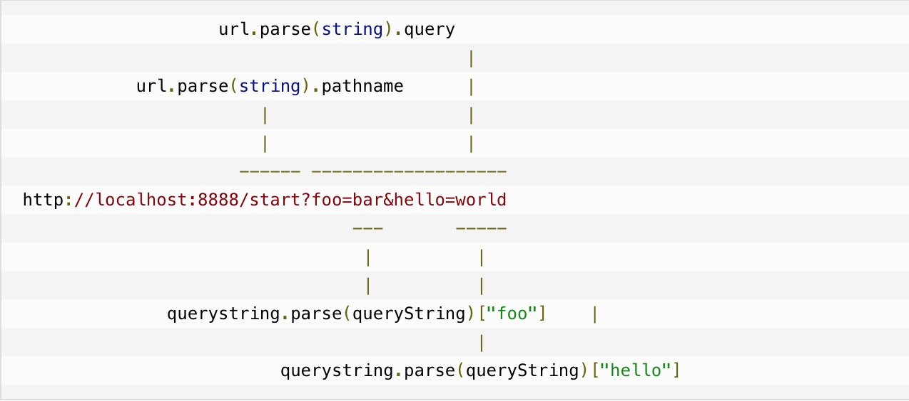

# 1. nodejs模块化
#### 模块化的概念与意义
* 为了让node.js的文件可以相互调用,node.js提供了一个简单的模块系统
* 模块是node.js应用程序的基本组成部分
* 文件和模块是一一对应的,一个nodejs文件就是一个模块
* 这个文件可能是JavaScript代码、JSON或者编译过的c、c++扩展

#### node.js中的模块
Node.js中存在4类模块(原生模块和3种文件模块)

#### node.js的模块加载流程


加载方式:
* 从文件模块缓存中加载
* 从原生模块加载
* 从文件加载

#### 模块化代码案例
require方法加载模块,require方法接收受以下几种参数的传递:
* http、fs、path等的原生模块
* 相对路径的文件模块
* 绝对路径的文件模块

代码案例:

建立模块文件hello.js
```JavaScript
//模块逻辑
function Hello(){
    var name;
    this.setName = function(argName){
        name = argName;
    }
    this.sayHello = function(){
        console.log('Hello ' + name);
    };
};
//模块导出
module.exports = Hello;
```
main.js中调用hello模块
```JavaScript
//调用模块
var Hello = require('./hello'); //对应hello.js

hello = new Hello();
hello.setName('张三');
hello.sayHello();
```

# 2. nodejs函数
与js函数几乎一样

#### 匿名函数
* 在js中,一个函数可以作为另一个函数的参数
* 我们可以先定义一个函数，然后传递，也可以在传递参数的地方直接定义函数(匿名函数)



# 3. nodejs路由

#### 什么是路由
路由器:一根网线让好几台电脑上网

路由:一个域名分成多个可访问地址

我们需要的所有数据都会包含在 request 对象中，该对象作为 onRequest() 回调函数的第一个参数传递。但是为了解析这些数据，我们需要额外的 Node.JS 模块，它们分别是 url 和 querystring 模块。

当然我们也可以用 querystring 模块来解析 POST 请求体中的参数，稍后会有演示。

现在我们来给 onRequest() 函数加上一些逻辑，用来找出浏览器请求的 URL 路径：

server.js 文件代码：
```JavaScript
var http = require("http");
var url = require("url");
 
function start() {
  function onRequest(request, response) {
    var pathname = url.parse(request.url).pathname;
    console.log("Request for " + pathname + " received.");
    response.writeHead(200, {"Content-Type": "text/plain"});
    response.write("Hello World");
    response.end();
  }
 
  http.createServer(onRequest).listen(8888);
  console.log("Server has started.");
}
 
exports.start = start;
```
好了，我们的应用现在可以通过请求的 URL 路径来区别不同请求了--这使我们得以使用路由（还未完成）来将请求以 URL 路径为基准映射到处理程序上。

在我们所要构建的应用中，这意味着来自 /start 和 /upload 的请求可以使用不同的代码来处理。稍后我们将看到这些内容是如何整合到一起的。

现在我们可以来编写路由了，建立一个名为 router.js 的文件，添加以下内容：

router.js 文件代码：
```JavaScript
//路由解析
function route(pathname) {
  console.log("About to route a request for " + pathname);
}
exports.route = route;
```
然后我们再扩展一下服务器的 start() 函数，以便将路由函数作为参数传递过去,用依赖注入的方式较松散地添加路由模块

server.js 文件代码：
```JavaScript
var http = require("http");
var url = require("url");
 
function start(route) {
  function onRequest(request, response) {
    var pathname = url.parse(request.url).pathname;
    console.log("Request for " + pathname + " received.");
 
    route(pathname);  //注入路由
 
    response.writeHead(200, {"Content-Type": "text/plain"});
    response.write("Hello World");
    response.end();
  }
 
  http.createServer(onRequest).listen(8888);
  console.log("Server has started.");
}
 
exports.start = start;
```
扩展 index.js，使得路由函数可以被注入到服务器中：
```JavaScript
var server = require("./server");
var router = require("./router");

server.start(router.route);
```
现在启动应用，随后请求一个URL
```
$ node index.js
```
浏览器访问 http://127.0.0.1:8888/,显示hello world