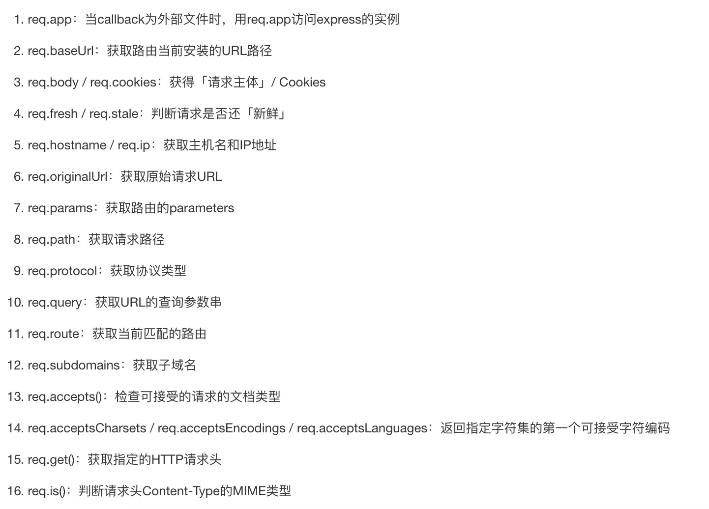
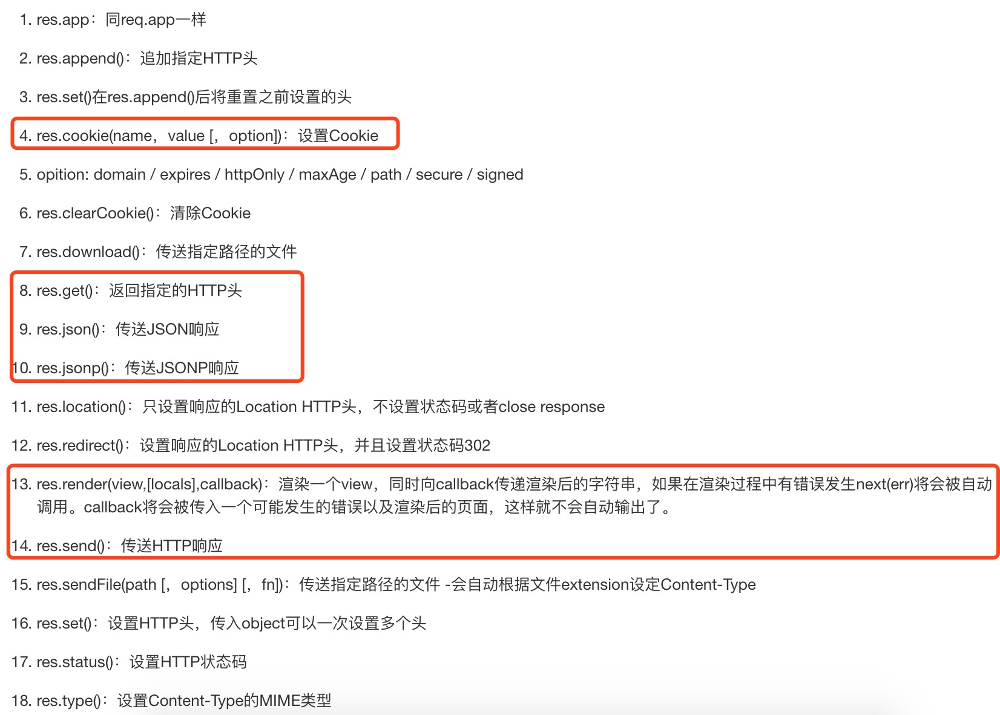

# Express 简介
基于 Node.js 平台，快速、开放、极简的 Web 开发框架

Express 框架核心特性：
* 可以设置中间件来响应 HTTP 请求。
* 定义了路由表用于执行不同的 HTTP 请求动作。
* 可以通过向模板传递参数来动态渲染 HTML 页面。

Express原班人马打造了另一个基于node.js的下一代web开发框架koa

# Express安装
在项目目录下
```
$ npm install express --save
```
以下几个重要的模块是需要与 express 框架一起安装的：在代码实例中(expresstest)因为没有用到所以没有安装下面三个中间件
```c
$ npm install body-parser --save // node.js 中间件，用于处理 JSON, Raw, Text 和 URL 编码的数据。
$ npm install cookie-parser --save //这就是一个解析Cookie的工具。通过req.cookies可以取到传过来的cookie，并把它们转成对象。
$ npm install multer --save //node.js 中间件，用于处理 enctype="multipart/form-data"（设置表单的MIME编码）的表单数据。
```

每更改都要重新启动node，可以安装supervisor,实现热启动实时更新
```
$ node xx.js

$ sudo npm install supervisor -g
$ supervisor xx.js
```

Express 框架实例:
```JavaScript
//express_demo.js 文件
var express = require('express');
var app = express();

var server = app.listen(8081, function () { //开启一个后台服务
    console.log("接口已启动");
});
//get路由监听
app.get('/', function (req, res) {
   res.send('Hello World');
});
```
执行该文件
```
$ node express_demo.js 
接口已启动
```
访问 http://127.0.0.1:8081,显示Hello World

## Request 对象
> 表示 HTTP 请求，包含了请求查询字符串，参数，内容，HTTP 头部等属性。

常见属性有：


## Response 对象
> 表示 HTTP 响应，即在接收到请求时向客户端发送的 HTTP 响应数据。

常见属性有：


## restful
> 一种软件架构风格、设计风格，而不是标准，只是提供了一组设计原则和约束条件。

简单说就是同一个访问设置不同的请求路由提取,如下面的/设置了get和post两种请求的处理
```JavaScript
//express_demo.js 文件
var express = require('express');
var app = express();

var server = app.listen(8081, function () { //开启一个后台服务
    console.log("接口已启动");
});
//加载静态资源
app.use(express.static('public'));

// get请求
app.get('/', function (req, res) {
   res.send('Hello World');
});
//  POST 请求
app.post('/', function (req, res) {
   console.log("主页 POST 请求");
   res.send('Hello POST');
})
```

## 静态文件
Express 提供了内置的中间件 express.static 来设置静态文件如：图片， CSS, JavaScript 等。

你可以使用 express.static 中间件来设置静态文件路径。例如，如果你将图片， CSS, JavaScript 文件放在 public 目录下，你可以这么写：
```
app.use(express.static('public'));
```